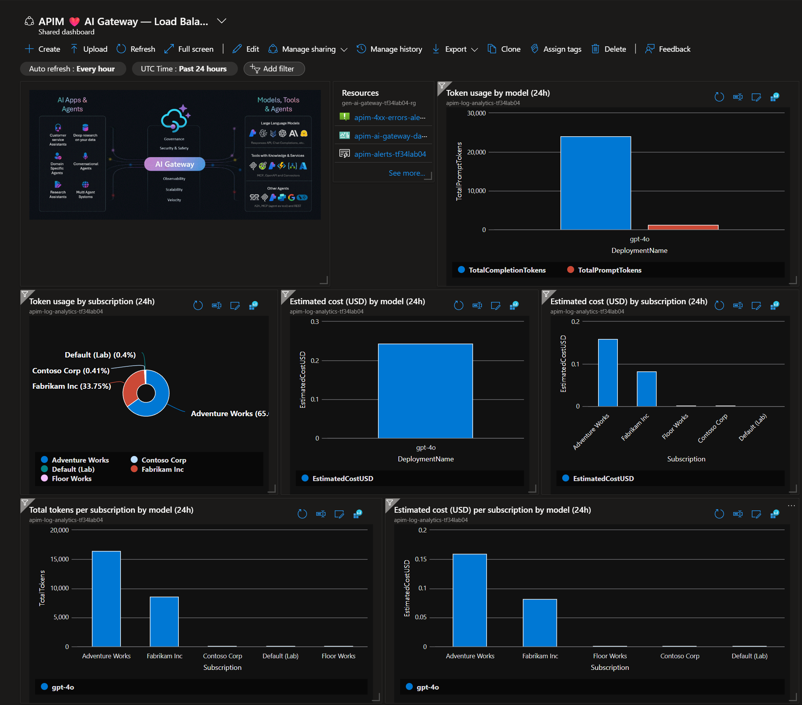

# Gen AI Gateway Lite

A **self-contained, Terraform-deployed** Azure API Management (APIM) gateway for multi-tenant Azure OpenAI workloads. Designed to demonstrate how APIM can manage, meter, and protect access to large language models — with per-tenant token rate limiting, cost estimation dashboards, content safety, and multi-region load balancing — all from a single `terraform apply`.

> **"Lite" means standalone.** This deployment creates its own VNet and resources in a single resource group. There are no private endpoints, no hub-spoke networking, and no shared DNS zones. It is purpose-built to showcase APIM + AI capabilities without infrastructure dependencies. For production deployments with enterprise networking (private endpoints, DNS, firewalls), engage your infrastructure team and see the [AI Gateway Landing Zone](https://github.com/Azure-Samples/AI-Gateway) for reference architectures.

---

## What Gets Deployed

A single `terraform apply` creates the following in one resource group:

| Resource | Purpose |
|---|---|
| **Azure API Management** (StandardV2) | Gateway with system-assigned managed identity, VNet-integrated |
| **Azure AI Services** x N | Multi-region OpenAI backends (configurable count and regions) |
| **Azure Content Safety** | Real-time prompt shielding and content moderation |
| **Virtual Network + Subnets** | Standalone VNet with APIM + private endpoint subnets |
| **Log Analytics Workspace** | Centralized logging (gateway logs, LLM token logs) |
| **Application Insights** | APM, distributed tracing, request/response logging |
| **Azure Portal Dashboard** | 8-tile operational dashboard with token + cost analytics |
| **Autoscaling Rules** | Capacity-based scale-out / scale-in for APIM |
| **Metric Alerts** | 4xx errors, capacity, and latency alert rules |
| **Per-tenant APIM Subscriptions** | Isolated API keys with individual rate limits |

### Architecture

```
                    +---------------+
  Tenant A -------->|               |      +-----------------------+
  Tenant B -------->|     APIM      |----->| AI Services (East US) |
  Tenant C -------->|   Gateway     |      +-----------------------+
                    |               |      +-----------------------+
                    | - Auth (MI)   |----->| AI Services (East US 2)|
                    | - Rate Limit  |      +-----------------------+
                    | - Metrics     |      +-----------------------+
                    | - Safety      |----->| AI Services (Sweden)  |
                    | - Routing     |      +-----------------------+
                    +-------+-------+
                            |
                    +-------v-------+      +-----------------------+
                    |Content Safety |      |  Portal Dashboard     |
                    +---------------+      |  Log Analytics        |
                                           |  App Insights         |
                                           +-----------------------+
```

---

## Connectivity & Security Model

```
  Internet                VNet (10.0.254.0/24)
     │                    ┌──────────────────────────────────────────┐
     │   HTTPS + api-key  │  APIM Subnet (/27)                      │
     ├───────────────────►│  ┌─────────────────┐                     │
     │                    │  │  APIM Gateway    │──── Managed Identity ──► AI Services (network ACL: allow APIM subnet)
     │                    │  │  (public IP)     │──── Managed Identity ──► Content Safety (network ACL: allow APIM subnet)
     │                    │  └─────────────────┘                     │
     │                    │                                          │
     │                    │  Private Endpoints Subnet (/25)          │
     │                    │  (reserved for production use)           │
     │                    └──────────────────────────────────────────┘
```

| Layer | Lite (this repo) | Production |
|---|---|---|
| **APIM frontend** | Public endpoint, authenticated via APIM subscription key (`api-key` header) | Same, or add OAuth 2.0 / JWT validation |
| **APIM → AI Services** | System-assigned managed identity (`Cognitive Services OpenAI User` role) — no API keys | Same (or user-assigned MI) |
| **APIM → Content Safety** | System-assigned managed identity (`Cognitive Services User` role) | Same |
| **AI Services network** | VNet service endpoint — network ACL allows APIM subnet only; public access disabled (`default_action = "Deny"`) | Private endpoint + private DNS zone |
| **Content Safety network** | VNet service endpoint — network ACL allows APIM subnet only; public access disabled | Private endpoint + private DNS zone |
| **Private endpoints** | Subnet reserved but not used | Required for full network isolation |

**Key points:**
- Tenants authenticate to APIM with their subscription key. APIM never exposes backend AI Services keys — it uses its managed identity to call downstream services.
- AI Services and Content Safety resources deny all traffic except from the APIM subnet via `network_acls { default_action = "Deny" }` with a VNet service endpoint rule.
- For production, replace service endpoints with **private endpoints** and configure private DNS zones so that traffic never leaves the Microsoft backbone. See the [Production Considerations](#production-considerations) table below.

---

## Key Features

### 1. Multi-Tenant Token Rate Limiting

Each tenant gets a dedicated APIM subscription key with **individual** token-per-minute (TPM) and quota limits. Limits are enforced via APIM's `llm-token-limit` policy — no shared counters, no noisy neighbors.

```hcl
apim_tenants = {
  contoso = {
    display_name      = "Contoso"
    tokens_per_minute = 20000       # premium tier
    token_quota       = 1000000     # 1M tokens / month
  }
  fabrikam = {
    display_name      = "Fabrikam"
    tokens_per_minute = 5000        # starter tier
    token_quota       = 200000      # 200K / month
  }
}
```

When a tenant exceeds their limit, they receive HTTP 429 — other tenants are unaffected.

### 2. Multi-Region Load Balancing with Circuit Breakers

Requests are distributed across AI Services instances using a **priority + weight** backend pool. If a backend returns 429 or 503, the circuit breaker trips for 1 minute and traffic fails over to other regions — with automatic retry respecting `Retry-After` headers.

### 3. Content Safety

Every prompt passes through Azure Content Safety (`llm-content-safety` policy) before reaching the model. Categories (Hate, SelfHarm, Violence) are evaluated with configurable severity thresholds. Content filters are also deployed on the AI Services instances themselves (defense in depth).

### 4. Managed Identity Authentication

APIM authenticates to all Azure AI Services using its **system-assigned managed identity** — no API keys stored or rotated. The `Cognitive Services OpenAI User` role is automatically assigned.

### 5. Operational Dashboard

An Azure Portal dashboard with 8 KQL-powered tiles is deployed automatically:

| Tile | Description |
|---|---|
| Token usage by model | Prompt vs. completion tokens per deployment |
| Token usage by subscription | Which tenants consume the most |
| Estimated cost by model | USD cost estimates per deployment |
| Estimated cost by subscription | USD cost estimates per tenant |
| Tokens per subscription by model | Stacked breakdown |
| Cost per subscription by model | Stacked breakdown |
| Token consumption over time | 12h time series by tenant + model |
| Remaining tokens per subscription | Rate limit headroom (1h) |

> **Important:** Cost figures are **estimates** calculated from token counts and the per-model prices you configure in `openai_deployments`. They do **not** use the Azure Cost Management API or reflect actual billed amounts. Treat them as directional for chargeback / showback conversations.



### 6. Autoscaling

APIM StandardV2 auto-scales based on capacity utilization. Thresholds, capacity limits, and cooldown are fully configurable via the `autoscale` variable:

```hcl
autoscale = {
  enabled             = true
  min_capacity        = 1
  max_capacity        = 10
  scale_out_threshold = 70        # scale out when capacity > 70%
  scale_in_threshold  = 30        # scale in  when capacity < 30%
  cooldown_period     = "PT5M"
}
```

### 7. Monitoring & Alerting

Metric alerts for 4xx errors, capacity utilization, and latency are created when `monitoring_alerting.enabled = true`. All thresholds and severity levels are configurable:

```hcl
monitoring_alerting = {
  enabled              = true
  alert_emails         = ["ops-team@contoso.com"]
  alert_severity       = 2           # 0=Critical … 4=Verbose
  error_4xx_threshold  = 10          # > N 4xx errors in 5 min
  capacity_threshold   = 70          # capacity >= N%
  latency_threshold_ms = 4000        # avg latency > N ms
}
```

### 8. Comprehensive Observability

- **ApiManagementGatewayLogs** — every request with status codes, latency, backend
- **ApiManagementGatewayLlmLog** — token counts, model names, prompt/completion details
- **Application Insights** — distributed traces with request/response body capture
- **AI Services diagnostics** — Audit, RequestResponse, Trace categories

---

## Prerequisites

- [Terraform](https://developer.hashicorp.com/terraform/install) >= 1.6
- [Azure CLI](https://learn.microsoft.com/cli/azure/install-azure-cli) (logged in: `az login`)
- An Azure subscription with permissions to create resources
- Azure OpenAI model access ([request access](https://aka.ms/oai/access) if needed)

---

## Quick Start

```bash
# 1. Clone and navigate
git clone <this-repo>
cd gen-ai-gateway-lite

# 2. Create your configuration
cp terraform.tfvars.example terraform.tfvars
# Edit terraform.tfvars — set subscription_id, app_suffix, tenants, etc.

# 3. Deploy
terraform init
terraform plan -out=tfplan
terraform apply tfplan

# 4. Retrieve outputs
terraform output apim_gateway_url
terraform output -json apim_tenant_subscription_keys
```

Deployment takes approximately 15-20 minutes (APIM provisioning is the bottleneck).

---

## Configuration Guide

### AI Services / Foundry Resources

Control **how many** backend OpenAI instances and **where** they are deployed:

```hcl
openai_config = {
  openai-eus = {
    name     = "ai-services-eastus"
    location = "eastus"
    priority = 1       # primary
    weight   = 100
  }
  openai-swc = {
    name     = "ai-services-swedencentral"
    location = "swedencentral"
    priority = 2       # failover
    weight   = 50
  }
}
```

Add or remove entries to change the number of backends. The APIM backend pool updates automatically.

### Model Deployments

Each model is deployed to **every** AI Services instance:

```hcl
openai_deployments = {
  gpt = {
    deployment_name = "gpt-4o"
    model_name      = "gpt-4o"
    model_version   = "2024-08-06"
    model_capacity  = 8           # 8K TPM per instance
    input_price     = 0.0025      # USD per 1K tokens (for dashboard)
    output_price    = 0.01
  }
}
```

The `input_price` / `output_price` fields are **optional** — they only affect cost estimation tiles in the dashboard.

### Tenant Configuration

This is the primary value of the solution. Each entry in `apim_tenants` creates:

1. A dedicated APIM subscription (API key)
2. A per-tenant `llm-token-limit` policy block
3. Dashboard analytics scoped to that tenant

```hcl
apim_tenants = {
  contoso = {
    display_name      = "Contoso"
    tenant_id         = "contoso-corp"
    state             = "active"       # or "suspended" to cut access
    tokens_per_minute = 20000          # null = use default (10K)
    token_quota       = 1000000        # null = use default (500K)
    token_quota_period = "Monthly"     # Hourly | Daily | Weekly | Monthly | Yearly
  }
}
```

Tenants that omit `tokens_per_minute` / `token_quota` inherit from the defaults:

```hcl
default_tokens_per_minute  = 10000
default_token_quota        = 500000
default_token_quota_period = "Monthly"
```

To **onboard a new tenant**: add an entry to `apim_tenants` and run `terraform apply`.
To **revoke access**: set `state = "suspended"`.

### Policy Templating

The APIM API-level policy is not a static XML file — it is a **Terraform template** (`policy.xml.tftpl`) rendered at deploy time using [`templatefile()`](https://developer.hashicorp.com/terraform/language/functions/templatefile). This is how per-tenant rate limits become real APIM policy without any manual XML editing.

During `terraform apply`, the template receives live values:

```hcl
# main.tf
xml_content = templatefile("policy.xml.tftpl", {
  backend_id                 = azapi_resource.apim-backend-pool-openai.name
  content_safety_backend_id  = azurerm_api_management_backend.content_safety_backend.name
  tenant_subscriptions       = local.tenant_subscriptions   # list of per-tenant objects
  default_tokens_per_minute  = var.default_tokens_per_minute
  default_token_quota        = var.default_token_quota
  default_token_quota_period = var.default_token_quota_period
})
```

Inside the template, a `%{ for }` loop generates a `<choose>` block with one `<when>` per tenant, matching on the APIM subscription GUID:

```xml
<!-- policy.xml.tftpl (excerpt) -->
<choose>
%{ for sub in tenant_subscriptions ~}
    <!-- ${sub.display_name}: ${sub.tokens_per_minute} TPM -->
    <when condition="@(context.Subscription.Id == &quot;${sub.subscription_id}&quot;)">
        <llm-token-limit counter-key="@(context.Subscription.Id)"
            tokens-per-minute="${sub.tokens_per_minute}"
            token-quota="${sub.token_quota}"
            token-quota-period="${sub.token_quota_period}"
            estimate-prompt-tokens="true" />
    </when>
%{ endfor ~}
    <otherwise>
        <!-- Default / lab subscription -->
        <llm-token-limit ... tokens-per-minute="${default_tokens_per_minute}" />
    </otherwise>
</choose>
```

**Why this approach?** APIM subscription IDs are only known after Terraform creates them, so the policy must be rendered dynamically. Adding a tenant to `apim_tenants` automatically generates its rate-limit block — no XML editing required.

To inspect the rendered output locally (requires `terraform init` + existing state):

```bash
./render-policy.sh
```

---

## Testing

### REST Client (VS Code)

The included `test-apim.http` file works with the [REST Client](https://marketplace.visualstudio.com/items?itemName=humao.rest-client) extension. After deployment, populate it with your keys:

```bash
terraform output apim_gateway_url
terraform output -json apim_tenant_subscription_keys
```

### Automated Token Limit Testing

The included `test_token_limits.py` loads configuration directly from Terraform outputs (no hardcoded secrets):

```bash
# Run all tests (auto-discovers tenants from terraform state)
python test_token_limits.py

# Burst-test a specific tenant
python test_token_limits.py --burst fabrikam
```

The script runs 3 phases:

1. **Connectivity** — sends a chat completion with each tenant's key
2. **Burst** — fires 10 concurrent requests to test rate limiting (expect HTTP 429)
3. **Isolation** — confirms other tenants are unaffected by the burst

### Render Policy Locally

To inspect the fully-rendered APIM policy XML with your live subscription GUIDs:

```bash
./render-policy.sh              # outputs to policy.xml
./render-policy.sh -o custom.xml
```

---

## File Structure

```
gen-ai-gateway-lite/
  main.tf                  # Core infrastructure (APIM, AI Services, Content Safety, etc.)
  variables.tf             # All variable definitions with defaults
  outputs.tf               # Gateway URL and subscription keys (sensitive)
  providers.tf             # Azure provider configuration
  dashboard.tf             # Azure Portal dashboard (8 KQL tiles)
  policy.xml.tftpl         # APIM API policy template (Terraform templatefile)
  global-policy.xml        # APIM global policy (IP filter + security headers)
  terraform.tfvars.example # Example configuration - start here
  test-apim.http           # REST Client test file
  test_token_limits.py     # Automated token limit test script
  render-policy.sh         # Render policy template using live Terraform state
```

---

## How the Policy Works

The APIM API-level policy (`policy.xml.tftpl`) runs a 6-step inbound pipeline:

1. **Extract Model** — reads the `deployment-id` from the URL or `model` from the JSON body
2. **Managed Identity Auth** — acquires a token for `cognitiveservices.azure.com`
3. **Token Rate Limiting** — a `<choose>` block matches `context.Subscription.Id` to apply per-tenant TPM and quota limits
4. **Token Metrics** — emits token counts as custom metrics (subscription + model dimensions)
5. **Content Safety** — evaluates the prompt against Hate, SelfHarm, and Violence categories
6. **Backend Routing** — forwards to the load-balanced backend pool

The backend section retries on 429/503 with circuit breaker support.

---

## Production Considerations

This "Lite" deployment is designed for **capability demonstration and proof-of-concept**. For production:

| Concern | Lite | Production |
|---|---|---|
| **Networking** | Standalone VNet, public endpoints | Hub-spoke, private endpoints, Azure Firewall |
| **DNS** | Default Azure DNS | Private DNS zones, split-horizon |
| **Identity** | System-assigned MI | User-assigned MI, conditional access |
| **Cost tracking** | Estimate-based dashboard | Azure Cost Management API integration |
| **Secrets** | Terraform output | Azure Key Vault, automated rotation |
| **CI/CD** | Manual `terraform apply` | GitHub Actions / Azure DevOps pipelines |
| **Multi-region APIM** | Single region | Premium SKU with multi-region gateways |

For production-grade infrastructure with enterprise networking, see:

- [AI Landing Zone](https://github.com/Azure/AI-Landing-Zones) — full reference architecture
- [Azure API Management Landing Zone Accelerator](https://github.com/Azure/apim-landing-zone-accelerator) - APIM Landing zone
- [AI Gateway Labs](https://github.com/Azure-Samples/AI-Gateway/tree/main/labs) - AI Gateway Labs

---

## Clean Up

```bash
terraform destroy
```

This removes all resources created by this deployment.

---

## License

This project is provided as-is for demonstration purposes.
